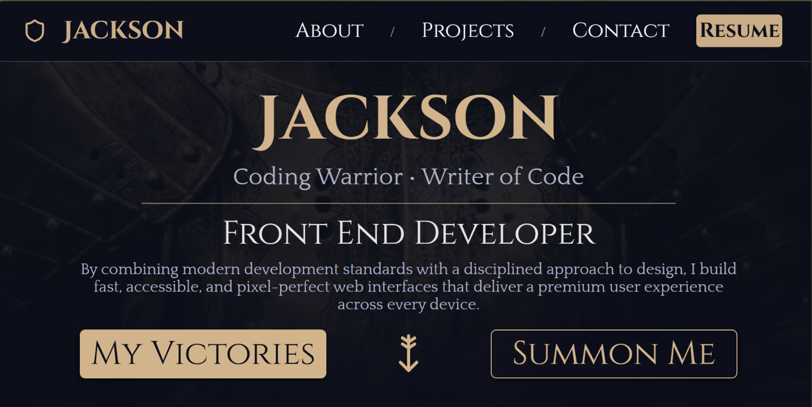

# 🌐 Jackson Clark — Developer Portfolio

[](https://github.com/J-Co-de/Jackson-Clark---Web-Developer)
[](https://github.com/J-Co-de/Jackson-Clark---Web-Developer)

A clean, responsive, accessibility-focused developer portfolio built with HTML, CSS, and JavaScript. This repository contains the source for my personal portfolio site and component styles.

---

## Demo

Live site: <[Jackson-Clark---Web-Developer](https://j-co-de.github.io/Jackson-Clark---Web-Developer/)>  

Screenshot



---

## Features

- Fully responsive layout built mobile-first
- Semantic HTML structure for accessibility and SEO
- Modular CSS components in `CSS_Components/`
- Lightweight JavaScript for small interactive bits

---

## Project structure

```
/
├── CSS_Components/     # Modular, reusable CSS components (see CSS_Components/README.md)
├── images/             # Optimized images and assets (confirm exact casing)
├── index.html          # Main entry point
├── styles.css          # Global styles + layout system
└── script.js           # Interactive behavior
```

---

## Tech stack

- HTML5
- CSS3
- JavaScript (ES6+)
- GitHub Pages (for deployment)

---

## Running locally

This is a static site — no build step required. Recommended options to run a local preview:

- Using VS Code Live Server extension (Recommended)

- Using Python's built-in server:

```bash
# from the repo root
python -m http.server 8000
# then open http://localhost:8000
```

- Or open `index.html` directly in your browser for a quick preview

---

## Clone

```
bash
git clone https://github.com/J-Co-de/Jackson-Clark---Web-Developer.git
```

---

## Deployment

This site is deployed via GitHub Pages. Typical steps to redeploy:

1. Push changes to the `main` branch (or the branch configured for GitHub Pages)
2. GitHub Pages will automatically build and publish the site

---

## Accessibility

- Keyboard navigation tested
- Sufficient color contrast (WCAG AA)
- ARIA attributes where appropriate
- Semantic elements (`header`, `nav`, `main`, `section`, `article`, `footer`)

---

## Contact

- Email: jclark3987@gmail.com
- LinkedIn (example profile URL): https://www.linkedin.com/in/jackson-clark-602b263a7/  

---

## Contributing

Contributions are not welcome.

---

## License

The license is in LICENSE.md.

---